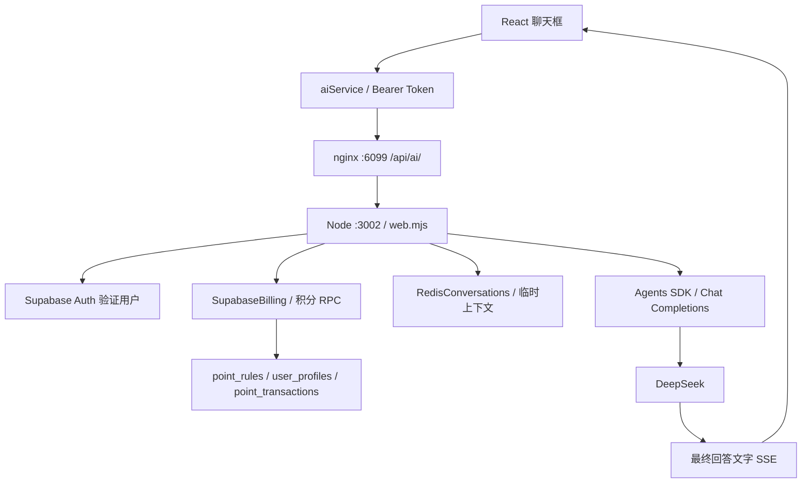

# AI 助手开发与运维文档

更新日期：2026-10-03。本文按仓库当前实现编写；服务器信息和验证结果沿用本次部署记录，本次文档编写没有重新发布或调用线上模型。

## 1. 当前能力与边界

网站已接入独立 Node.js AI 服务，使用 OpenAI Agents SDK 调用 DeepSeek，支持登录鉴权、流式回答、多轮临时上下文、动态积分预扣与退款、取消生成和异常状态查询。

当前只提供一般学习和选课建议，**尚未接入教师评价、评分、课表、学校资料、联网或 RAG 工具**。提示词要求模型不能编造这些信息。提示词不等于事实校验，后续查询能力仍需通过可信工具实现。

聊天记录只在当前页面显示：关闭弹窗后重新打开保留已有消息，关闭时会停止正在生成的回答；刷新、退出或切换账号后清空页面记录。Redis 中的临时记录按 TTL 到期，不等同于持久化聊天历史。清空按钮创建新会话 ID，不会立即删除旧 Redis 数据。

## 2. 架构与代码入口



| 文件 | 职责 |
| --- | --- |
| `server/ai/agent.mjs` | 模型客户端、提示词、模型参数，未来注册工具的位置 |
| `server/ai/index.mjs` | 组装依赖、启动服务、退款恢复任务、退出处理 |
| `server/ai/app.mjs` | Express、健康检查、内部调试接口 |
| `server/ai/web.mjs` | 网站鉴权、请求校验、流式响应、计费编排与取消 |
| `server/ai/storage.mjs` | Redis 会话存储与 Supabase 积分适配器 |
| `server/ai/test/` | 后端测试，模拟模型调用 |
| `server/ai/ask.mjs`、`smoke.mjs` | 内部 HTTP 调试、直接模型冒烟测试 |
| `src/services/aiService.ts` | 登录凭证、HTTP 请求、SSE 解析、状态与取消接口 |
| `src/components/AiAssistantModal.tsx` | 消息、Markdown、停止、价格和余额展示 |
| `src/App.tsx` | 网站入口、账号切换及余额联动 |
| `supabase/ai-billing.sql` | 已应用的积分数据库变更记录 |
| `supabase/verify-ai-billing.sql` | 数据库事务回滚验证脚本 |
| `server/ai/swjtu-ai.service`、`nginx-ai.conf` | 服务和代理配置模板 |

## 3. 模型配置

后端是独立 ESM npm 包，要求 Node.js 22 及以上，使用自己的 `package-lock.json`。当前固定 `@openai/agents@0.18.0`；安装应使用 `npm ci`，不要在发布时随意升级依赖。

`createAgent()` 设置以下行为：

- 从 `LLM_API_KEY`、`LLM_BASE_URL`、`LLM_MODEL` 创建 OpenAI 兼容客户端；默认地址为 `https://api.deepseek.com`，默认模型为 `deepseek-flash`。
- `setOpenAIAPI('chat_completions')`：使用 Chat Completions。
- `setTracingDisabled(true)`：关闭 SDK 向 OpenAI 上传 tracing。
- 客户端超时 120 秒，`maxRetries: 0`；不自动重试模型请求。
- `maxTokens: 4096`，`thinking.type: enabled`，`reasoning_effort: low`。
- `run()` 使用 `stream: true`、`AbortSignal`、`maxTurns: 3`。

**当前是开启模型思考、隐藏思考内容，而非关闭模型思考。** 网站只消费 `toTextStream()` 的回答文本，不返回或保存 `reasoning_content`。思考仍可能消耗模型额度。`maxTurns` 是 Agent 运行轮次上限，不是用户对话历史轮数。

以上是当前版本的实际配置，不代表供应商模型名或兼容性长期不变。换模型、升级 SDK 或接入工具后，应重新验证流式输出、取消和工具调用，尤其是思考模式下工具往返消息的兼容性。

## 4. 环境变量与本地启动

配置模板见 [`server/ai/.env.example`](../server/ai/.env.example)。真实配置只保存在服务器 `/etc/swjtu-ai.env`，不要写进仓库、前端 `VITE_*` 配置或日志。

| 变量 | 用途 |
| --- | --- |
| `LLM_API_KEY` | 模型 API 凭证，必填 |
| `LLM_BASE_URL` | 模型 API 基础地址 |
| `LLM_MODEL` | 模型标识 |
| `AI_DEBUG_TOKEN` | 内部调试凭证，至少 32 字符；网站模式下仍必填 |
| `AI_WEB_ENABLED` | 精确为 `true` 才启用网站鉴权与计费路由 |
| `SUPABASE_URL` | Supabase 项目地址 |
| `SUPABASE_SERVICE_ROLE_KEY` | 后端专用 service_role 或 secret key |
| `REDIS_HOST`、`REDIS_PORT` | 默认 `127.0.0.1:6379` |
| `REDIS_USERNAME`、`REDIS_PASSWORD` | Redis ACL 用户与密码；网站模式要求密码 |

本地开发，在 `server/ai` 目录安装依赖，准备未纳入 Git 的环境文件：

```bash
npm ci --ignore-scripts
node --env-file=.env index.mjs
npm test
```

入口不会自动加载 `.env`；本地需显式使用 `--env-file`，线上由 systemd 注入。网站模式还需要可连接的 Supabase 和 Redis。前端使用同源 `/api/ai`，本地开发应为该路径配置代理至 `127.0.0.1:3002`，否则 Vite 不会自动转发到 AI 服务。

## 5. 网站 API

所有 `/api/ai/*` 网站接口都要求 `Authorization: Bearer <Supabase access_token>`。后端通过 `auth.getUser(token)` 获取用户身份，不接收客户端指定的计费用户 ID。以下接口仅在 `AI_WEB_ENABLED=true` 时采用此协议。

### 配置与价格

`GET /api/ai/config` 返回 `available`、`cost`、`balance`、`maxLength`。`cost` 是从启用的 `point_rules.action_code = ai_question` 负数 `points_delta` 转成的正数。规则无效时 `available=false`、`cost=null`；查询失败时不提供默认价格。

### 发起问答

`POST /api/ai/chat` 请求示例（`expectedCost` 必须填写刚获取的实际价格）：

```json
{
  "prompt": "帮我规划一周的高数复习",
  "conversationId": "78c09a7e-a329-4c75-aad9-b79e9d04d09a",
  "requestId": "9215d881-f8de-493d-81e1-5ad1d8634a0d",
  "expectedCost": 2
}
```

示例中的 `2` 不是固定收费规则。问题要求非空且不超过 1000 个 JavaScript 字符单位；两个 ID 必须为 UUID；价格必须为正整数。浏览器不提交完整历史，由后端读取当前用户的会话缓存。

成功预扣后打开 SSE。每条数据为 `data: <JSON>\n\n`，每 10 秒发送 `: heartbeat\n\n` 注释保活。

| `type` | 字段与含义 |
| --- | --- |
| `status` | `phase: thinking`、`balance`、`cost`、`requestId`，说明已预扣、开始生成 |
| `delta` | `text`，追加到当前回答 |
| `done` | `status: settled`、`balance`、`cost`、`requestId`；部分路径另含 `changed`，表示结算成功 |
| `error` | `message`、`status`、`requestId`，可能另含余额与价格；需按实际状态确认是否退款 |

只有 `done` 才表示完整成功。HTTP 200、收到部分文字或连接正常关闭，都不能单独证明成功。网站协议没有 `[DONE]` 字符串。流开始前可能返回 JSON 错误；流开始后错误通过 SSE 返回。

### 状态与取消

- `GET /api/ai/requests/:id`：返回 `status`、`cost`、`balance`，以及存在时的 `expiresAt`；已结算且缓存仍在时附带 `reply`。
- `POST /api/ai/requests/:id/cancel`：写入取消标记并中止当前进程活跃任务，返回数据库当时的状态。

状态为 `not_found`、`pending`、`settled` 或 `refunded`。取消响应里的 `pending` 不代表已退款；前端继续查询直至确认。已经结算的请求不会因之后的取消而退款。

| HTTP 状态 | 常见含义 |
| --- | --- |
| 400 / 413 | 参数错误或请求体超过 8 KB |
| 401 | 缺少登录或登录失效 |
| 402 | 积分不足 |
| 409 | 价格变动、请求 ID 冲突、重复请求、账号存在 pending 或积分账户未就绪 |
| 429 | 并发或频率限制 |
| 503 | 规则不可用、依赖失败、生成失败或超时 |

## 6. 计费、幂等与故障恢复

复用现有 `point_transactions`，没有新建积分流水表。数据库结构和 RPC 详见 [AI 积分数据库接入约定](ai-billing-database.md)。

一次请求按以下顺序处理：

1. 验证身份、参数、并发和频率，读取 Redis 历史并筛选数据库确认已结算的轮次。
2. 对 `JSON.stringify({ conversationId, prompt: prompt.trim() })` 计算 SHA-256，作为 `request_hash`。
3. 调用 `ai_reserve_points`。数据库读取最新规则，检查 `expectedCost`、余额与请求幂等，锁定账户并预扣，生成五分钟有效期的 pending 流水。
4. 只有 `created=true` 才调用模型；重复请求返回 409 及已有状态，避免重复扣费和重复生成。
5. 流式生成完整、非空回答后，先把回答和上下文暂存 Redis，再调用 `ai_finalize_points(..., 'settled', 'completed')`。
6. 检查 RPC 实际返回 `settled` 后发送 `done`。发生异常、超时或取消时查询数据库状态，对仍为 pending 的请求执行退款。

终态不可互相转换；退款按原扣款金额增加退款流水，不受后续调价影响。若数据库响应丢失，后端会查询实际状态，避免把已结算请求误认为失败。暂存但未结算的上下文不会参与下一次生成。

后端启动时以及每 60 秒调用一次 `ai_refund_expired_points`，每次最多处理 100 条。进程崩溃、数据库断连留下的 pending 在到期后由恢复任务处理；数据库故障或积压可能延迟退款，不能承诺恰好五分钟到账。

网络异常时先使用原 `requestId` 查询状态，不要直接创建新请求。协议重放应复用原 ID 和相同内容；主动重新提问才使用新 ID。当前前端“重新编辑并发送”属于新请求，不是自动网络重试。聊天入口不可再次调用旧 `spend_points`，否则会重复计费。

## 7. 临时会话、限制与前端行为

Redis 前缀为 `swjtu:ai:v1:`，各 key 按用户隔离：

| key 后缀（前面加前缀和用户 ID） | 内容 | TTL |
| --- | --- | --- |
| `:conversation:<conversationId>` | `{ requestId, prompt, reply }` 数组 | 每次保存后 3600 秒 |
| `:result:<requestId>` | `{ reply }` | 3600 秒 |
| `:cancel:<requestId>` | 取消标记 | 600 秒 |
| `:rate:minute` | 请求尝试计数 | 首次计数起 60 秒 |

每次调用最多带入 8 轮已结算对话，历史总长度超过 20000 时从最早一轮移除；该长度不含本次问题。Redis 保存最多 8 轮，下一次读取时再裁剪长度。缓存过期后仍可查积分状态，但无法保证恢复回答正文。

当前默认限制：每账号一条生成中请求；网站路由单进程最多两条；每账号每个 60 秒窗口最多六次尝试；请求总超时 120 秒；回答文本超过 24000 字符触发失败；模型最大输出 4096 tokens。部分参数是函数默认值或代码常量，尚无对应环境变量。

Redis 限流跨进程共享，数据库也拒绝同账号多个 pending；全局并发和即时 AbortController 保存在内存。**当前按单实例部署设计**：扩容时需增加分布式并发控制与取消通知，不能仅增加 Node 进程。内部调试另有独立的两条并发额度。

前端通过 `fetch` 读取 POST SSE；连接中断时查询积分状态，不确定期间阻止继续发送，并在弹窗打开时每五秒查询。Markdown 使用 `react-markdown`，跳过原始 HTML、不显示图片，外部链接带 `noopener noreferrer`。UUID 使用 `crypto.getRandomValues` 构造，以兼容当前 HTTP 页面。

## 8. 部署与运维

当前部署记录：

| 项目 | 值 |
| --- | --- |
| 服务器 | `47.108.145.230`，SSH 22 |
| 网站 | `http://47.108.145.230:6099/` |
| AI 目录 | `/opt/swjtu-ai`（对应仓库 `server/ai` 内容） |
| Node | 部署验证时为 22.22.2 |
| systemd | `swjtu-ai.service`，运行用户 `swjtu-ai` |
| 环境文件 | `/etc/swjtu-ai.env`，root 所有、权限 600 |
| 监听地址 | `127.0.0.1:3002` |
| Redis ACL | AI 独立账号，限制到 `swjtu:ai:v1:*` |

后端代码上传到 `/opt/swjtu-ai` 后，在服务器执行：

```bash
cd /opt/swjtu-ai
umask 022
npm ci --omit=dev --ignore-scripts
npm test
systemctl restart swjtu-ai
systemctl status swjtu-ai --no-pager
curl --fail http://127.0.0.1:3002/health
journalctl -u swjtu-ai -n 50 --no-pager
```

代码和依赖应允许服务账号读取；环境文件保持 600，由 systemd 读取。更新单元文件后先执行 `systemctl daemon-reload`。现有发布约定为原地更新，不建立版本备份目录，Git 由用户自行提交。

nginx 模板见 [`server/ai/nginx-ai.conf`](../server/ai/nginx-ai.conf)，应放入现有监听 6099 的 `server` 块，保留其他 API 路由。模板使用 `location ^~ /api/ai/`，转发至 3002，关闭缓冲、缓存和 gzip，读取超时 150 秒。现有站点配置文件的绝对路径未在仓库模板中固定，修改前使用 `nginx -T` 确认实际加载位置。

```bash
nginx -t
nginx -s reload
```

前端修改后，在仓库根目录执行 `npm run lint`、`npm test`、`npm run build`，再按现有网站静态资源发布流程更新。只修改后端时不需要重建前端。

### 内部调试

```bash
cd /opt/swjtu-ai
node --env-file=/etc/swjtu-ai.env ask.mjs '你现在能做什么？'
node --env-file=/etc/swjtu-ai.env smoke.mjs
```

这两个命令会产生真实模型费用。`npm test` 使用模拟模型，不产生 API 费用。

网站模式下，内部接口为 `POST /internal/ai/chat`，仅接收 `prompt`，要求 `x-debug-token`。它不走网站积分和会话流程，返回 `{ "t": "文本" }`，成功以 `data: [DONE]` 结束；失败为 JSON `error`。未开启网站模式时，调试接口占用 `/api/ai/chat`，切换模式时须注意协议差异。

当前 nginx 模板不转发 `/internal/ai/`。本地调试可开 SSH 隧道：

```bash
ssh -N -L 13002:127.0.0.1:3002 root@47.108.145.230
```

随后访问 `http://127.0.0.1:13002/health`。健康接口只说明进程可响应，不检查模型、数据库和 Redis 的完整可用性；其中 `active` 仅统计内部调试请求。

### 故障定位

- 无流式效果：检查 nginx 缓冲、压缩及上游代理；浏览器必须逐段消费 SSE。
- 401：网站检查 Supabase access token；内部调试检查 debug token，不要混用。
- 402 / 价格变动：重新读取 `/config`，检查余额和 `ai_question` 规则，不在前端补默认价格。
- pending 长时间未恢复：检查服务和数据库连通性，以及日志中的 `[ai-recovery]`；确认退款扫描正在运行。
- 页面收到文字但没有成功结束：查询请求状态；已结算时尝试从结果缓存恢复。
- 启动失败：检查必需变量、Redis ACL/连接和代码读取权限。日志不得加入密钥、Bearer token 或完整聊天正文。

当前网站仍为 HTTP，登录凭证和聊天流量没有 TLS 传输保护；后续域名与 HTTPS 上线时应同步调整入口。模型停止只能尽力中断调用，不能撤销供应商已经产生的费用；网站积分退款与模型账单是两个不同系统。

## 9. 后续扩展约定（尚未实现）

### 接入工具和 RAG

建议新增 `server/ai/tools/`，在 `createAgent()` 的 `tools` 中注册工具，通过依赖注入访问后端数据服务。工具参数应有 schema、长度和数量上限；用户身份由后端注入，不能让模型指定任意用户或执行任意 SQL。

教师姓名、评分、课程等结构化信息优先使用受限数据库查询；长评价和学校资料可通过 `document_chunks` 检索。该表用于保存文档片段及 embedding，不是聊天记录表，也尚未接入当前 Agent。RAG 上线前需确定 embedding 服务、维度、分块和更新策略、检索索引、来源标识及数据访问权限，并做实际召回测试。

工具返回精简且可追溯的数据，由模型组织回答；工具无结果时明确说明，不补造事实。接入后更新提示词，增加工具调用、权限隔离、超时取消、空结果和失败退款测试。重新评估 `maxTurns: 3` 和总超时，确认 DeepSeek 思考模式下的工具消息兼容性；不要直接把内部思考字段传给浏览器。

### 持久化聊天

当前 `RedisConversations` 已集中提供 `history/save/result/saveResult/cancel/cancelled/rate`。后续可保留 Redis 处理限流与取消，把历史和结果读写替换为数据库实现或组合适配器。

持久化上线前另行设计会话、消息、归属校验、保留期限及删除流程，并调整当前“刷新清空”的产品行为。仅将已结算轮次作为可用上下文，保留 `requestId` 与积分流水的关联；聊天正文不要塞入积分流水。新增聊天存储也不需要另建积分流水表。

## 10. 验证基线

本次部署已有记录：16 项 AI 后端测试、66 项项目测试、TypeScript 检查和生产构建通过；真实请求验证了连续对话、动态费用、重复请求不重复扣费、取消退款；桌面及手机验证了流式展示、页面记录生命周期和 Markdown 安全展示。测试临时账号和数据已清理。

这些是部署时的验证结果，并非持续健康保证。后续变更应按影响范围复测，尤其不能用 HTTP 200 代替 `done` 与数据库最终结算状态检查。
