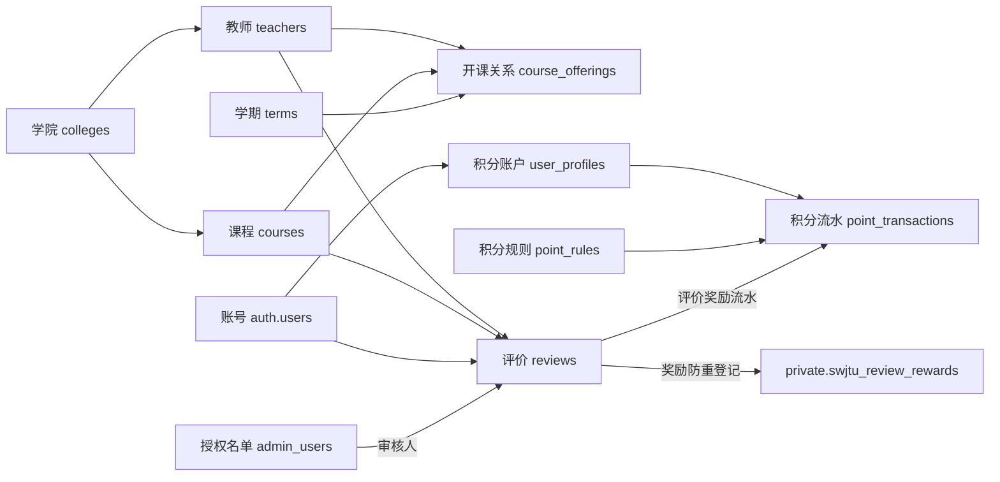

# Supabase 数据表与字段中文说明

整理日期：2026-09-26。依据此前提供的线上结构、本地适配文件和 P1 迁移。本文解释数据库，不执行任何数据库修改。`document_chunks` 的完整字段和 Supabase 系统表清单尚未取得，下文明确标出范围。

## 看表前先认几个词

数据库的一张表可以理解成一张有固定列的 Excel 表：一行是一条记录；表头是字段名，每列只保存某一种信息。

| 名词/标记 | 中文意思 | 例子 |
| --- | --- | --- |
| schema | 表的命名空间，类似分类目录 | `public`、`auth`、`private` |
| `public` | 本项目大多数业务表所在目录 | 名字叫 public 不代表任何人都能读写，仍由授权及 RLS 控制 |
| `auth` | Supabase 身份认证相关表所在目录 | 用户账号、登录会话等 |
| `private` | 本项目内部辅助对象所在目录 | 评价奖励防重表 |
| `id` / PRIMARY KEY / PK | 一行记录的唯一编号（主键） | 教师编号、评价编号 |
| `xxx_id` / FOREIGN KEY / FK | 指向另一张表中某条记录的编号；是否为 FK 要看约束 | `teacher_id` 指向某位教师 |
| `text` | 文本 | 姓名、评论，某些 ID 也用文本存储 |
| `uuid` | 一种随机唯一编号类型 | 学院、课程、学期、管理员记录的 ID |
| `int4` / integer | 整数 | 积分、评价数量 |
| numeric | 小数 | 评分 4.5 |
| `bool` / boolean | 是或否，值为 true/false | 是否启用 |
| `date` | 只有年月日 | 最后签到日期 |
| `timestamptz` | 代表一个具体时刻的时间戳；显示时可按时区转换 | 创建时间、审核时间 |
| `jsonb` | 可以保存列表或对象的结构化数据 | 标签列表 |
| NULL | 没有填写/未知 | 未审核时审核时间为空；不等于数字 0 或空字符串 |
| NOT NULL | 不允许为空 | 必填字段 |
| DEFAULT | 新增记录未提供该字段时采用的值 | 默认状态 pending；不代表之后不能修改 |
| UNIQUE | 不允许重复的值或组合 | 学院名唯一；开课组合唯一 |
| RLS | 按每条记录判断谁能读写 | 用户只能查看自己的积分 |

`created_at` 一般是数据库记录的创建时间，不是教师入职时间、学期开始时间。`is_...` 通常是判断项，true 表示“是”，false 表示“否”。

## 表的总览

| 表 | 中文用途 | 一行代表什么 |
| --- | --- | --- |
| `public.colleges` | 学院资料 | 一个学院 |
| `public.teachers` | 教师资料及汇总评分 | 一位教师 |
| `public.courses` | 课程资料 | 一门课程 |
| `public.terms` | 学期资料 | 一个学期 |
| `public.course_offerings` | 开课关系 | 某教师在某学期教某门课 |
| `public.reviews` | 学生评价及审核结果 | 一条评价 |
| `public.user_profiles` | 用户积分账户 | 一个用户的余额及签到状态 |
| `public.point_rules` | 积分规则 | 一种加分/扣分行为的规则 |
| `public.point_transactions` | 积分流水 | 一次实际积分变动 |
| `public.admin_users` | 管理员授权名单 | 一个被授权的邮箱及其角色 |
| `private.swjtu_review_rewards` | 评价奖励防重登记 | 一条已处理奖励的评价 ID |
| `auth.users` | Supabase 登录账号 | 一个注册账号 |
| `public.document_chunks` | 从命名看属于 AI 文档分块用途，具体结构待确认 | 尚未取得列定义，不能确定每行的实际结构 |

## 1. colleges：学院表

| 字段 | 中文含义 |
| --- | --- |
| `id` | 学院的唯一编号 |
| `name` | 学院名称，如“计算机与人工智能学院” |
| `campus` | 学院记录中的校区 |
| `created_at` | 这条学院记录的创建时间 |

教师和课程通过 `college_id` 关联学院，避免到处重复填写学院名称。用户注册时的学院信息在 Auth 用户元数据中，不会因选择学院而向此表新增一行。

## 2. teachers：教师表

| 字段 | 中文含义 |
| --- | --- |
| `id` | 教师唯一编号，类型是 TEXT |
| `name` | 教师姓名 |
| `title` | 职称，如讲师、副教授、教授 |
| `college_id` | 所属学院编号，对应 `colleges.id` |
| `campus` | 教师所属或授课校区信息 |
| `overall_score` | 综合评分，当前触发器会对已通过评价的各项有效评分求综合平均 |
| `review_count` | 统计的已通过评价数量，不包含待审和被驳回评价 |
| `attendance_strictness` | 点名/考勤严格度的汇总分 |
| `grading_leniency` | 给分宽松程度的汇总分 |
| `effort_matters` | 给分是否看努力的汇总分 |
| `workload_difficulty` | 作业量/难度的汇总分 |
| `approachability` | 教师亲和力的汇总分 |
| `teaching_quality` | 教学质量的汇总分 |
| `has_historical_data` | 是否标记为有历史来源数据；该标记不是计数，评分触发器也不会自动维护它 |
| `tags` | 教师标签列表，JSON 数据，例如 `["讲解清晰", "给分宽松"]`；例子不代表线上实际标签 |
| `created_at` | 这条教师记录的创建时间 |

教师表保存汇总值，原始逐条评分在 `reviews` 中。审核和评价变更会触发统计更新；当前评分函数在没有有效评分可计算时保留旧分数，所以 `review_count=0` 时仍可能有显示分数。

### teachers 和 reviews 中共用的六个评分字段

项目表单使用 1–5 分，其文字含义如下。它们不是统一的“越高越好”。

| 字段 | 中文 | 1 分方向 | 5 分方向 |
| --- | --- | --- | --- |
| `attendance_strictness` | 点名/考勤严格度 | 几乎不点名 | 每节课都点名 |
| `grading_leniency` | 给分宽松程度 | 给分严格 | 给分大方 |
| `effort_matters` | 给分是否看努力 | 躺平也能拿分 | 越认真投入越有回报 |
| `workload_difficulty` | 作业量/难度 | 作业少、压力小 | 作业多、难度高 |
| `approachability` | 师生亲和力 | 严肃、难沟通 | 友善、好沟通 |
| `teaching_quality` | 教学质量 | 讲解薄弱、照念课件 | 讲解清晰、内容扎实 |

`attendance_strictness` 描述教师课堂考勤，不是本站用户每天领积分的签到。`effort_matters` 在不同页面存在“越努力分越高”和“必须认真投入”的措辞差异，这里按评价表单解释。当前综合分直接平均各维度，并没有先将考勤严格度、作业难度反向换算成满意度。

## 3. courses：课程表

| 字段 | 中文含义 |
| --- | --- |
| `id` | 课程唯一编号 |
| `name` | 课程名称，如“高等数学” |
| `college_id` | 课程所属学院，对应 `colleges.id` |
| `created_at` | 这条课程记录的创建时间 |

这里描述“这是什么课”。谁教、哪个学期开，放在 `course_offerings`。现有约束对课程名称与学院的组合判重，不是全校课程名一律不能重复。

## 4. terms：学期表

| 字段 | 中文含义 |
| --- | --- |
| `id` | 学期唯一编号 |
| `year_term` | 学期名称，如“2026-2027第1学期”；例子仅说明格式 |
| `is_current` | 是否标记为当前学期 |
| `created_at` | 这条学期记录的创建时间 |

`is_current=true` 是一个标记，不会随日历自动改变；当前项目结构也没有保证只能一条记录为 true 的唯一约束。

## 5. course_offerings：开课关系表

| 字段 | 中文含义 |
| --- | --- |
| `id` | 这条开课关系的唯一编号 |
| `teacher_id` | 哪位老师，对应 `teachers.id` |
| `course_id` | 哪门课程，对应 `courses.id` |
| `term_id` | 哪个学期，对应 `terms.id` |
| `created_at` | 这条开课关系的创建时间 |

一行可理解为：“张老师在 2026-2027 第 1 学期教高等数学”。同一教师、课程、学期组合不能重复。此表没有教学班号或上课时间段字段，不能把一行直接解释成一个具体教学班。

## 6. reviews：评价表

| 字段 | 中文含义 |
| --- | --- |
| `id` | 评价唯一编号 |
| `teacher_id` | 被评价的老师，对应 `teachers.id` |
| `course_id` | 评价涉及的课程，对应 `courses.id` |
| `year_term` | 作者填写/选择的授课学期文本；不是 `terms.id` |
| `attendance_strictness` | 这一条评价对考勤严格度的打分 |
| `grading_leniency` | 这一条评价对给分宽松度的打分 |
| `effort_matters` | 这一条评价对努力与得分关系的打分 |
| `workload_difficulty` | 这一条评价对作业量/难度的打分 |
| `approachability` | 这一条评价对亲和力的打分 |
| `teaching_quality` | 这一条评价对教学质量的打分 |
| `comment` | 文字评价正文 |
| `author_nickname` | 评价中保存的作者显示昵称；不会因后来修改账号昵称就自动更新 |
| `user_id` | 写评价的用户 ID；业务上对应登录账号，现有结构未为此列建立指向 Auth 的外键 |
| `is_historical_migrated` | 是否为历史数据迁入的评价；此类评价不参与新评价奖励 |
| `status` | 审核状态：`pending` 待审核，`approved` 已通过，`rejected` 已驳回 |
| `reject_reason` | 驳回原因；正常提交或审核通过后为空 |
| `reviewer_id` | 审核管理员记录的 ID，对应 `admin_users.id`，不是作者 ID，也不是直接引用 Auth 用户 ID |
| `reviewed_at` | 最近一次审核的时间 |
| `likes` | 点赞数量字段；当前前端点赞只更新页面状态，不能把该列的存在理解成已完成云端点赞功能 |
| `created_at` | 评价记录的创建时间，不是审核时间 |

此表保存最近的审核人和结果，不是完整的历次审核日志。修改被驳回评价重新提交时，前端清空原因并设为 pending，目前不会同时清空上次审核人和审核时间，因此不能只看 reviewed_at 判断当前是否已通过。

## 7. user_profiles：用户积分账户表

| 字段 | 中文含义 |
| --- | --- |
| `id` | 用户 ID，值对应 `auth.users.id`，本表用 TEXT 保存；现有结构没有声明指向 Auth 的外键 |
| `points` | 当前积分余额 |
| `last_checkin_date` | 最后一次成功领取签到奖励的日期，按北京时间判断 |
| `created_at` | 积分档案创建时间 |

虽然名称叫 profiles，当前它主要管理积分，不包含完整的个人资料。邮箱、登录密码由 Auth 管理；昵称、学院、校区在 Auth 用户元数据中。此表的 points 是当前余额，历史增减过程查 `point_transactions`。

## 8. point_rules：积分规则表

| 字段 | 中文含义 |
| --- | --- |
| `action_code` | 程序识别某种积分行为的唯一代码；这张表用它作为主键，没有另外的 id 列 |
| `label` | 该行为的中文显示名称 |
| `points_delta` | 每次变动的积分，正数增加、负数扣除 |
| `is_active` | 规则是否启用；签到、消费、新评价奖励函数会检查 |
| `description` | 规则的文字说明，本身不会执行逻辑 |

此前报告中的规则：

| action_code | 中文用途 | points_delta | 状态 |
| --- | --- | ---: | --- |
| `new_user_welcome` | 新用户欢迎积分 | +100 | 启用 |
| `system_init` | 上线初期初始化赠分 | +100 | 停用 |
| `daily_checkin` | 每日签到 | +5 | 启用 |
| `review_approved` | 评价审核通过 | +20 | 启用 |
| `ai_question` | AI 提问 | -2 | 启用 |
| `smart_filter` | 智能筛选 | -3 | 启用 |
| `guide_unlock` | 攻略解锁 | -10 | 启用 |

这些数值是此前报告的配置，P1 迁移没有改写它们。保留的线上注册触发器仍写死赠送 100 分；仅修改欢迎积分规则不会改变正常注册触发器的发奖金额。是否已有规则也不代表对应产品功能已经完成。

## 9. point_transactions：积分流水表

| 字段 | 中文含义 |
| --- | --- |
| `id` | 这次积分变动的唯一编号 |
| `user_id` | 变动属于谁，对应 `user_profiles.id` |
| `action_code` | 变动属于哪种行为，对应 `point_rules.action_code` |
| `action` | 这次变动的文字备注；是此次迁移补上的可空字段，旧记录可能为空 |
| `amount` | 这一次实际增加或扣除多少分 |
| `balance_after` | 这次变动发生后，当时的余额快照；不会随后续消费而更新 |
| `related_review_id` | 如果是某条评价的奖励，关联 `reviews.id`；签到/注册一般没有 |
| `timestamp` | 本次变动的发生时间 |

例如签到前余额 100，签到 +5 的流水保存 `amount=5`、`balance_after=105`。后来又获得评价奖励 +20，新增一条 `amount=20`、`balance_after=125`，旧签到流水的余额快照仍是 105。

区别是：`points_delta` 是规则规定的金额，`amount` 是当次实际发生的金额，`points` 是账户当前余额。未来修改规则不会自动改写历史流水。

## 10. admin_users：管理员授权名单

| 字段 | 中文含义 |
| --- | --- |
| `id` | 这条管理员授权记录的唯一编号；它与 Auth 用户 ID 是不同概念 |
| `email` | 被授权的登录邮箱 |
| `role` | 管理员角色：`super_admin` 超级管理员，`admin` 管理员，`moderator` 审核员 |
| `nickname` | 管理端显示的昵称，不是自动同步的用户昵称 |
| `is_active` | 该授权是否启用；false 表示停用该管理员资格 |
| `created_at` | 这条管理员授权记录的创建时间 |

它不是所有用户的账号列表。正常注册不会自动加入此表。服务器通过当前登录用户已验证的邮箱匹配启用的名单；超管可以管理名单，admin/moderator 可以审核。数据库里出现其他 role 文本并不会自动获得审核权限。

## 11. private.swjtu_review_rewards：奖励防重登记表

| 字段 | 中文含义 |
| --- | --- |
| `review_id` | 已处理奖励的评价 ID，同时作为主键，使同一评价只能登记一次 |
| `user_id` | 对应作者 ID |
| `awarded_at` | 登记时间；正常新奖励时与发奖接近，迁移回填记录为回填时刻，不能当作历史真实发奖时间 |

它是“这个评价的奖励已经处理过”的登记，不是另一份可消费余额。没有挂到 reviews 的删除外键，因此评价删除后标记也能保留。普通客户端不能直接读写。迁移回填也包含原有已通过但未找到奖励流水的评价，所以不能仅凭本表判断历史上确实到账过多少积分。

## 12. auth.users：Supabase 注册账号表

这是 Supabase 维护的系统表，字段比业务表多。与当前程序直接相关的常见字段如下，不代表已完整列出线上所有 Auth 字段。

| 字段 | 中文含义 |
| --- | --- |
| `id` | 用户身份唯一编号，登录后的 `auth.uid()` 对应它 |
| `email` | 注册/登录邮箱 |
| `encrypted_password` | Auth 管理的密码哈希，不是可直接读出的明文密码 |
| `email_confirmed_at` | 邮箱确认时间；为空表示尚未记录确认 |
| `raw_user_meta_data` | 用户元数据，本项目保存昵称、学院、校区；SDK 中通常显示为 `user_metadata` |
| `raw_app_meta_data` | Auth 管理的应用元数据，例如身份提供方；当前项目不靠它授予业务管理员资格 |
| `created_at` | 账号创建时间 |
| `updated_at` | 账号记录更新时间 |
| `last_sign_in_at` | 最近登录时间 |
| `role` | Supabase API 使用的数据库角色，常见为 authenticated；不是本项目的 admin/super_admin 角色 |

其他 auth 下的 identities、sessions、refresh_tokens 等表用于身份来源、会话和令牌；若在 Supabase 中看到 storage 下的表，它们属于文件存储。这些不是本次 P1 迁移新建的业务表。

## 13. document_chunks：字段尚待确认

此前约束报告确认 public 中有这张表，但 preflight 的字段查询没有包含它，本地也没有它的建表定义。按名称推测是将资料切成小段供 AI 检索使用，不能据此断言实际有哪些字段、是否使用向量或已经接入问答。

需要核对时可在 SQL Editor 执行下面的只读查询。它只读取字段结构，不读取文档正文，也不修改数据库：

```sql
SELECT column_name, data_type, udt_name, is_nullable, column_default
FROM information_schema.columns
WHERE table_schema = 'public' AND table_name = 'document_chunks'
ORDER BY ordinal_position;
```

## 表之间如何连起来

下图是业务关系，既含数据库外键，也含代码维护的逻辑对应，不表示每条线都有外键约束。



例如：“某用户写了张老师高等数学的评价，审核后奖励 20 分”，会涉及 auth.users 确认作者身份、teachers/courses 标识评价对象、reviews 保存内容及审核、admin_users 确认审核资格、point_rules 读取奖励、user_profiles 更新余额、point_transactions 记录变动、swjtu_review_rewards 防止重复奖励。
