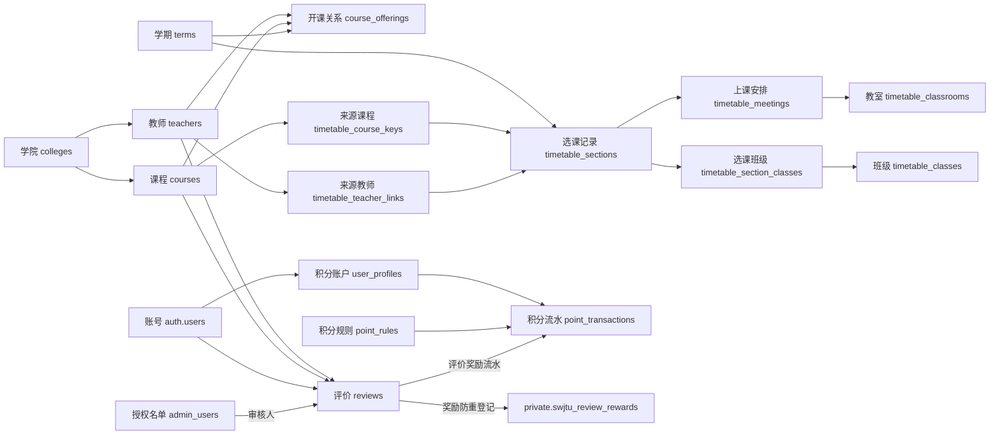

# Supabase 数据表与字段中文说明

更新日期：2026-09-30。本文包含 community v2 和 2026-2027 第 1 学期课表导入后的结构；课表部分依据已执行的 `schule2026-2027-1/supabase-web-import/04-import.sql` 及其生成源文件，并未重新连接线上数据库核验实际行数。此前业务表的说明依据已有线上结构、本地适配文件和 P1 迁移。本文解释数据库，不执行任何数据库修改。`document_chunks` 的完整字段和 Supabase 系统表清单尚未取得，下文明确标出范围。

## 看表前先认几个词

数据库的一张表可以理解成一张有固定列的 Excel 表：一行是一条记录；表头是字段名，每列只保存某一种信息。

| 名词/标记 | 中文意思 | 例子 |
| --- | --- | --- |
| schema | 表的命名空间，类似分类目录 | `public`、`auth`、`private` |
| `public` | 本项目大多数业务表所在目录 | 名字叫 public 不代表任何人都能读写，仍由授权及 RLS 控制 |
| `auth` | Supabase 身份认证相关表所在目录 | 用户账号、登录会话等 |
| `private` | 本项目内部辅助对象所在目录 | 评价奖励防重表 |
| `id` / PRIMARY KEY / PK | 一行记录的唯一编号（主键） | 教师编号、评价编号 |
| `xxx_id` / FOREIGN KEY / FK | 指向另一张表中某条记录的编号；是否为 FK 要看约束 | `teacher_id` 指向某位教师 |
| `text` | 文本 | 姓名、评论，某些 ID 也用文本存储 |
| `uuid` | 一种随机唯一编号类型 | 学院、课程、学期、管理员记录的 ID |
| `int4` / integer | 整数 | 积分、评价数量 |
| numeric | 小数 | 评分 4.5 |
| `bool` / boolean | 是或否，值为 true/false | 是否启用 |
| `date` | 只有年月日 | 最后签到日期 |
| `timestamptz` | 代表一个具体时刻的时间戳；显示时可按时区转换 | 创建时间、审核时间 |
| `jsonb` | 可以保存列表或对象的结构化数据 | 标签列表 |
| NULL | 没有填写/未知 | 未审核时审核时间为空；不等于数字 0 或空字符串 |
| NOT NULL | 不允许为空 | 必填字段 |
| DEFAULT | 新增记录未提供该字段时采用的值 | 默认状态 pending；不代表之后不能修改 |
| UNIQUE | 不允许重复的值或组合 | 学院名唯一；开课组合唯一 |
| RLS | 按每条记录判断谁能读写 | 用户只能查看自己的积分 |

`created_at` 一般是数据库记录的创建时间，不是教师入职时间、学期开始时间。`is_...` 通常是判断项，true 表示“是”，false 表示“否”。

## 表的总览

| 表 | 中文用途 | 一行代表什么 |
| --- | --- | --- |
| `public.colleges` | 学院资料 | 一个学院 |
| `public.teachers` | 教师资料及汇总评分 | 一位教师 |
| `public.courses` | 课程资料 | 一门课程 |
| `public.terms` | 学期资料 | 一个学期 |
| `public.course_offerings` | 开课关系 | 某教师在某学期教某门课 |
| `public.timetable_teacher_links` | 课表教师映射 | 一个来源院系与教师姓名的组合及其匹配结果 |
| `public.timetable_course_keys` | 课表课程映射 | 一个来源院系与课程代码的组合及其课程 ID |
| `public.timetable_college_updates` | 教师学院变更记录 | 一次课表导入对某教师学院的变更 |
| `public.timetable_classes` | 班级 | 一个班级编号 |
| `public.timetable_classrooms` | 教室 | 某校区内一间教室 |
| `public.timetable_sections` | 选课记录 | 一个学期的一个选课编号 |
| `public.timetable_section_classes` | 选课记录与班级关联 | 一个选课编号面向的一个班级 |
| `public.timetable_meetings` | 上课安排 | 一个选课编号的一段原始时间地点安排 |
| `public.timetable_upload_2026_2027_1` | 网页导入中转表 | 上传包中的一条 JSON 记录，非业务课表 |
| `public.reviews` | 学生评价及审核结果 | 一条评价 |
| `public.user_profiles` | 用户积分账户 | 一个用户的余额及签到状态 |
| `public.point_rules` | 积分规则 | 一种加分/扣分行为的规则 |
| `public.point_transactions` | 积分流水 | 一次实际积分变动 |
| `public.admin_users` | 管理员授权名单 | 一个被授权的邮箱及其角色 |
| `private.swjtu_review_rewards` | 评价奖励防重登记 | 一条已处理奖励的评价 ID |
| `auth.users` | Supabase 登录账号 | 一个注册账号 |
| `public.document_chunks` | 从命名看属于 AI 文档分块用途，具体结构待确认 | 尚未取得列定义，不能确定每行的实际结构 |

## 1. colleges：学院表

| 字段 | 中文含义 |
| --- | --- |
| `id` | 学院的唯一编号 |
| `name` | 学院名称，如“计算机与人工智能学院” |
| `campus` | 学院记录中的校区 |
| `created_at` | 这条学院记录的创建时间 |

教师和课程通过 `college_id` 关联学院，避免到处重复填写学院名称。用户注册时的学院信息在 Auth 用户元数据中，不会因选择学院而向此表新增一行。

## 2. teachers：教师表

| 字段 | 中文含义 |
| --- | --- |
| `id` | 教师唯一编号，类型是 TEXT |
| `name` | 教师姓名 |
| `title` | 职称，如讲师、副教授、教授 |
| `college_id` | 所属学院编号，对应 `colleges.id` |
| `campus` | 教师所属或授课校区信息 |
| `overall_score` | 综合评分，当前触发器会对已通过评价的各项有效评分求综合平均 |
| `review_count` | 统计的已通过评价数量，不包含待审和被驳回评价 |
| `attendance_strictness` | 考勤宽松度的汇总分 |
| `grading_leniency` | 给分宽松程度的汇总分 |
| `effort_matters` | 给分是否看努力的汇总分 |
| `workload_difficulty` | 作业轻松度的汇总分 |
| `approachability` | 教师亲和力的汇总分 |
| `teaching_quality` | 教学质量的汇总分 |
| `has_historical_data` | 是否标记为有历史来源数据；该标记不是计数，评分触发器也不会自动维护它 |
| `tags` | 教师标签列表，JSON 数据，例如 `["讲解清晰", "给分宽松"]`；例子不代表线上实际标签 |
| `created_at` | 这条教师记录的创建时间 |

教师表保存汇总值，原始逐条评分在 `reviews` 中。审核和评价变更会触发统计更新；当前评分函数在没有有效评分可计算时保留旧分数，所以 `review_count=0` 时仍可能有显示分数。

课表导入将 `overall_score` 和六个维度的 `NOT NULL` 约束及默认值移除。新建且未获评价的教师，这七项填 `NULL`，`review_count=0`；已有教师的评分和评价没有因导入而重置。根据本次课表，对同一教师能唯一确定学院时，导入会更新 `teachers.college_id` 并在 `timetable_college_updates` 留痕；有多个或没有可确定学院时保留原学院。新教师最初可归入“课表教师院系待核实”学院，随后按唯一映射规则更新。

### teachers 和 reviews 中共用的六个评分字段

项目表单使用 1–5 分，其文字含义如下。现在六项统一为“越高越好”。

| 字段 | 中文 | 1 分方向 | 5 分方向 |
| --- | --- | --- | --- |
| `attendance_strictness` | 考勤宽松度 | 每节课都点名 | 几乎不点名 |
| `grading_leniency` | 给分宽松程度 | 给分严格 | 给分大方 |
| `effort_matters` | 努力回报 | 努力回报少 | 越认真投入越有回报 |
| `workload_difficulty` | 作业轻松度 | 作业多、难度高 | 作业少、压力小 |
| `approachability` | 师生亲和力 | 严肃、难沟通 | 友善、好沟通 |
| `teaching_quality` | 教学质量 | 讲解薄弱、照念课件 | 讲解清晰、内容扎实 |

`attendance_strictness` 描述教师课堂考勤，不是本站用户每天领积分的签到。`effort_matters` 统一表示“努力回报”，越高表示认真投入越有回报。执行 v2 迁移后，旧考勤和作业分数会反转；此后综合分平均方向一致的维度。

## 3. courses：课程表

| 字段 | 中文含义 |
| --- | --- |
| `id` | 课程唯一编号 |
| `name` | 课程名称，如“高等数学” |
| `college_id` | 课程所属学院，对应 `colleges.id` |
| `created_at` | 这条课程记录的创建时间 |

这里描述“这是什么课”。谁教、哪个学期开，放在 `course_offerings`。现有约束对课程名称与学院的组合判重，不是全校课程名一律不能重复。

## 4. terms：学期表

| 字段 | 中文含义 |
| --- | --- |
| `id` | 学期唯一编号 |
| `year_term` | 学期名称，如“2026-2027第1学期”；例子仅说明格式 |
| `is_current` | 是否标记为当前学期 |
| `created_at` | 这条学期记录的创建时间 |

`is_current=true` 是一个标记，不会随日历自动改变；当前项目结构也没有保证只能一条记录为 true 的唯一约束。本次导入建立或复用 `2026-2027第1学期`，并将该学期设为当前、其他学期设为非当前。

## 5. course_offerings：开课关系表

| 字段 | 中文含义 |
| --- | --- |
| `id` | 这条开课关系的唯一编号 |
| `teacher_id` | 哪位老师，对应 `teachers.id` |
| `course_id` | 哪门课程，对应 `courses.id` |
| `term_id` | 哪个学期，对应 `terms.id` |
| `created_at` | 这条开课关系的创建时间 |

一行可理解为：“张老师在 2026-2027 第 1 学期教高等数学”。同一教师、课程、学期组合不能重复。此表没有教学班号或上课时间段字段，不能把一行直接解释成一个具体教学班。

课表导入还会为已明确匹配的主讲教师和单次安排教师补充开课关系；歧义且尚未匹配的教师不会伪造教师 ID。具体选课编号、班级和周次仍要查询下文的 `timetable_*` 表。

## 6. reviews：评价表

| 字段 | 中文含义 |
| --- | --- |
| `id` | 评价唯一编号 |
| `teacher_id` | 被评价的老师，对应 `teachers.id` |
| `course_id` | 评价涉及的课程，对应 `courses.id` |
| `year_term` | 作者填写/选择的授课学期文本；不是 `terms.id` |
| `attendance_strictness` | 这一条评价对考勤宽松度的打分 |
| `grading_leniency` | 这一条评价对给分宽松度的打分 |
| `effort_matters` | 这一条评价对努力与得分关系的打分 |
| `workload_difficulty` | 这一条评价对作业轻松度的打分 |
| `approachability` | 这一条评价对亲和力的打分 |
| `teaching_quality` | 这一条评价对教学质量的打分 |
| `comment` | 文字评价正文 |
| `author_nickname` | 评价中保存的作者显示昵称；不会因后来修改账号昵称就自动更新 |
| `user_id` | 写评价的用户 ID；业务上对应登录账号，现有结构未为此列建立指向 Auth 的外键 |
| `is_historical_migrated` | 是否为历史数据迁入的评价；此类评价不参与新评价奖励 |
| `status` | 审核状态：`pending` 待审核，`approved` 已通过，`rejected` 已驳回 |
| `reject_reason` | 驳回原因；正常提交或审核通过后为空 |
| `reviewer_id` | 审核管理员记录的 ID，对应 `admin_users.id`，不是作者 ID，也不是直接引用 Auth 用户 ID |
| `reviewed_at` | 最近一次审核的时间 |
| `likes` | 点赞数量字段；新版通过 review_likes 记录与 RPC 维护，含历史点赞基数 |
| `created_at` | 评价记录的创建时间，不是审核时间 |

此表保存最近的审核人和结果，不是完整的历次审核日志。修改被驳回评价重新提交时，前端清空原因并设为 pending，目前不会同时清空上次审核人和审核时间，因此不能只看 reviewed_at 判断当前是否已通过。

## 7. user_profiles：用户积分账户表

| 字段 | 中文含义 |
| --- | --- |
| `id` | 用户 ID，值对应 `auth.users.id`，本表用 TEXT 保存；现有结构没有声明指向 Auth 的外键 |
| `points` | 当前积分余额 |
| `last_checkin_date` | 最后一次成功领取签到奖励的日期，按北京时间判断 |
| `created_at` | 积分档案创建时间 |

虽然名称叫 profiles，当前它主要管理积分，不包含完整的个人资料。邮箱、登录密码由 Auth 管理；昵称、学院、校区在 Auth 用户元数据中。此表的 points 是当前余额，历史增减过程查 `point_transactions`。

## 8. point_rules：积分规则表

| 字段 | 中文含义 |
| --- | --- |
| `action_code` | 程序识别某种积分行为的唯一代码；这张表用它作为主键，没有另外的 id 列 |
| `label` | 该行为的中文显示名称 |
| `points_delta` | 每次变动的积分，正数增加、负数扣除 |
| `is_active` | 规则是否启用；签到、消费、新评价奖励函数会检查 |
| `description` | 规则的文字说明，本身不会执行逻辑 |

此前报告中的规则：

| action_code | 中文用途 | points_delta | 状态 |
| --- | --- | ---: | --- |
| `new_user_welcome` | 新用户欢迎积分 | +100 | 启用 |
| `system_init` | 上线初期初始化赠分 | +100 | 停用 |
| `daily_checkin` | 每日签到 | +5 | 启用 |
| `review_approved` | 评价审核通过 | +20 | 启用 |
| `ai_question` | AI 提问 | -2 | 启用 |
| `smart_filter` | 智能筛选 | -3 | 启用 |
| `guide_unlock` | 攻略解锁 | -10 | 启用 |

这些数值是此前报告的配置，P1 迁移没有改写它们。保留的线上注册触发器仍写死赠送 100 分；仅修改欢迎积分规则不会改变正常注册触发器的发奖金额。是否已有规则也不代表对应产品功能已经完成。

## 9. point_transactions：积分流水表

| 字段 | 中文含义 |
| --- | --- |
| `id` | 这次积分变动的唯一编号 |
| `user_id` | 变动属于谁，对应 `user_profiles.id` |
| `action_code` | 变动属于哪种行为，对应 `point_rules.action_code` |
| `action` | 这次变动的文字备注；是此次迁移补上的可空字段，旧记录可能为空 |
| `amount` | 这一次实际增加或扣除多少分 |
| `balance_after` | 这次变动发生后，当时的余额快照；不会随后续消费而更新 |
| `related_review_id` | 如果是某条评价的奖励，关联 `reviews.id`；签到/注册一般没有 |
| `timestamp` | 本次变动的发生时间 |

例如签到前余额 100，签到 +5 的流水保存 `amount=5`、`balance_after=105`。后来又获得评价奖励 +20，新增一条 `amount=20`、`balance_after=125`，旧签到流水的余额快照仍是 105。

区别是：`points_delta` 是规则规定的金额，`amount` 是当次实际发生的金额，`points` 是账户当前余额。未来修改规则不会自动改写历史流水。

## 10. admin_users：管理员授权名单

| 字段 | 中文含义 |
| --- | --- |
| `id` | 这条管理员授权记录的唯一编号；它与 Auth 用户 ID 是不同概念 |
| `email` | 被授权的登录邮箱 |
| `role` | 管理员角色：`super_admin` 超级管理员，`admin` 管理员，`moderator` 审核员 |
| `nickname` | 管理端显示的昵称，不是自动同步的用户昵称 |
| `is_active` | 该授权是否启用；false 表示停用该管理员资格 |
| `created_at` | 这条管理员授权记录的创建时间 |

它不是所有用户的账号列表。正常注册不会自动加入此表。服务器通过当前登录用户已验证的邮箱匹配启用的名单；超管可以管理名单，admin/moderator 可以审核。数据库里出现其他 role 文本并不会自动获得审核权限。

## 11. private.swjtu_review_rewards：奖励防重登记表

| 字段 | 中文含义 |
| --- | --- |
| `review_id` | 已处理奖励的评价 ID，同时作为主键，使同一评价只能登记一次 |
| `user_id` | 对应作者 ID |
| `awarded_at` | 登记时间；正常新奖励时与发奖接近，迁移回填记录为回填时刻，不能当作历史真实发奖时间 |

它是“这个评价的奖励已经处理过”的登记，不是另一份可消费余额。没有挂到 reviews 的删除外键，因此评价删除后标记也能保留。普通客户端不能直接读写。迁移回填也包含原有已通过但未找到奖励流水的评价，所以不能仅凭本表判断历史上确实到账过多少积分。

## 12. auth.users：Supabase 注册账号表

这是 Supabase 维护的系统表，字段比业务表多。与当前程序直接相关的常见字段如下，不代表已完整列出线上所有 Auth 字段。

| 字段 | 中文含义 |
| --- | --- |
| `id` | 用户身份唯一编号，登录后的 `auth.uid()` 对应它 |
| `email` | 注册/登录邮箱 |
| `encrypted_password` | Auth 管理的密码哈希，不是可直接读出的明文密码 |
| `email_confirmed_at` | 邮箱确认时间；为空表示尚未记录确认 |
| `raw_user_meta_data` | 用户元数据，本项目保存昵称、学院、校区；SDK 中通常显示为 `user_metadata` |
| `raw_app_meta_data` | Auth 管理的应用元数据，例如身份提供方；当前项目不靠它授予业务管理员资格 |
| `created_at` | 账号创建时间 |
| `updated_at` | 账号记录更新时间 |
| `last_sign_in_at` | 最近登录时间 |
| `role` | Supabase API 使用的数据库角色，常见为 authenticated；不是本项目的 admin/super_admin 角色 |

其他 auth 下的 identities、sessions、refresh_tokens 等表用于身份来源、会话和令牌；若在 Supabase 中看到 storage 下的表，它们属于文件存储。这些不是本次 P1 迁移新建的业务表。

## 13. document_chunks：字段尚待确认

此前约束报告确认 public 中有这张表，但 preflight 的字段查询没有包含它，本地也没有它的建表定义。按名称推测是将资料切成小段供 AI 检索使用，不能据此断言实际有哪些字段、是否使用向量或已经接入问答。

需要核对时可在 SQL Editor 执行下面的只读查询。它只读取字段结构，不读取文档正文，也不修改数据库：

```sql
SELECT column_name, data_type, udt_name, is_nullable, column_default
FROM information_schema.columns
WHERE table_schema = 'public' AND table_name = 'document_chunks'
ORDER BY ordinal_position;
```

## 2026-2027 第 1 学期课表数据

导入的来源是 `schule2026-2027-1/courses.csv`，一条 CSV 记录对应 `timetable_sections` 中一个选课编号。上传中转包有 10,064 行，包含 1 条元信息、2,524 条来源教师映射、1,895 条来源课程映射、1,042 条班级和 4,602 条选课记录；不能把中转行数当课程数。来源共解析出 6,979 段上课安排。实际线上数量以查询为准，重复增量导入不会为同一学期、同一选课编号重复插入。

### 课表教师与课程映射

| 表 | 字段 | 中文含义 |
| --- | --- | --- |
| `timetable_teacher_links` | `source_key` TEXT PK | 来源开课单位与姓名组成的序列化键；不是教师主页 ID |
| | `source_name`, `source_department` TEXT | 来源姓名、开课单位 |
| | `teacher_id` TEXT NULL FK → `teachers.id` | 已匹配/新增教师的现有资料页 ID；歧义时为空 |
| | `match_status` TEXT | `matched` 复用已有教师、`created` 新建、`manual` 人工指定、`pending` 待核实 |
| | `candidate_ids` TEXT[] | 待核实的同名候选教师 ID |
| | `homepages` JSONB | 来源教师主页列表 |
| | `created_at` TIMESTAMPTZ | 映射创建时间 |
| `timetable_course_keys` | `source_key` TEXT PK | 来源开课单位与课程代码组成的序列化键 |
| | `course_code`, `source_department` TEXT | 原始课程代码、开课单位；两列组合唯一 |
| | `course_id` UUID FK → `courses.id` | 复用或新建的课程 ID |
| `timetable_college_updates` | `source_digest`, `config_digest`, `teacher_id` | 来源、映射配置和教师 ID 组成的联合主键；`teacher_id` 关联 `teachers.id` |
| | `old_college_id`, `new_college_id` UUID FK → `colleges.id` | 修改前、修改后的学院；旧值可为空 |
| | `changed_at` TIMESTAMPTZ | 更新记录时间 |

同名教师在数据库中只有一个候选时，按姓名复用原 ID，即使原学院不同也不会再建教师页；多个候选时保持 `pending`，不得凭开课单位猜测身份。`timetable_college_updates` 是学院修改留痕，普通客户端无读取权限，并非教师任职历史的完整记录。

### 班级、选课记录和教室

| 表 | 字段 | 中文含义 |
| --- | --- | --- |
| `timetable_classes` | `code` TEXT PK | 班级编号，按文本保存以保留前导零 |
| | `name` TEXT NULL | 可明确对应的班级名称；来源冲突或未能配对时可为空 |
| | `created_at` TIMESTAMPTZ | 创建时间 |
| `timetable_classrooms` | `id` UUID PK | 教室 ID，默认随机生成 |
| | `campus`, `name` TEXT | 校区和教室名称，组合唯一 |
| `timetable_sections` | `id` UUID PK | 选课记录 ID |
| | `term_id` UUID FK → `terms.id` | 所属学期；与 `selection_code` 组合唯一 |
| | `selection_code` TEXT | 原始选课编号，不是课程代码 |
| | `course_key` TEXT FK → `timetable_course_keys.source_key` | 对应来源课程 |
| | `primary_teacher_key` TEXT NULL FK → `timetable_teacher_links.source_key` | 主讲教师来源键；无教师时为空，歧义时映射行可存在而 `teacher_id` 为空 |
| | `credits` NUMERIC(6,2), `nature`, `campus` TEXT | 学分、必修/选修性质、校区 |
| | `preferred` TEXT | CSV 中的原始“优选”文本 |
| | `enrolled` INTEGER, `capacity` INTEGER NULL | 已选人数、容量；来源未知容量保存为空 |
| | `source_row` JSONB, `source_hash` TEXT | 原始 CSV 行及其指纹，用于增量导入时核对是否改变 |
| | `created_at` TIMESTAMPTZ | 创建时间 |
| `timetable_section_classes` | `section_id` UUID FK → `timetable_sections.id`, `class_code` TEXT FK → `timetable_classes.code` | 联合主键，关联一个选课编号和一个班级；删除选课记录时级联删除关联 |
| | `source_class_name` TEXT NULL | 该选课记录里配对得到的班级名称，不一定等于公共班级名称 |

`timetable_sections` 的人数、容量和课程性质是导入时的来源快照，不会自动同步学校选课系统。相同学期的选课编号若已存在但原始行不同，导入事务报错并回滚，不覆盖原有课表。

### 上课安排及查询视图

| 对象 | 字段 | 中文含义 |
| --- | --- | --- |
| `timetable_meetings` | `id` UUID PK, `section_id` UUID FK → `timetable_sections.id` | 一段上课安排；删除选课记录时级联删除 |
| | `source_index` INTEGER | 原行中的安排序号；与 `section_id` 组合唯一 |
| | `weeks` INTEGER[] | 实际上课周次，非空，限定在 1–53 周；例如单周可保存为 `[1,3,5,7]` |
| | `weekday`, `period_start`, `period_end` INTEGER NULL | 星期一为 1、星期日为 7；周次已知但具体星期/节次不明时三者均为空，已知则均不为空，节次限定 1–24 |
| | `classroom_id` UUID NULL FK → `timetable_classrooms.id` | 可识别的上课教室；未知时为空 |
| | `teacher_key` TEXT NULL FK → `timetable_teacher_links.source_key` | 该段安排单独标出的教师，可能与主讲教师不同 |
| | `group_label` TEXT NULL | 来源中的 G1/G2 等分组标记，不是教师 |
| | `raw_schedule`, `raw_location` TEXT | 来源的时间和地点原文，便于核对 |
| `timetable_schedule` VIEW | `section_id`, `selection_code`, `term_id`, `year_term`, `course_code`, `course_id`, `course_name`, `source_department` | 将选课、学期和课程合并到一行查询 |
| | `primary_teacher_id/name`, `meeting_teacher_id/name`, `teacher_id/name`, `teacher_match_status` | 分别展示主讲、单次安排及最终使用的教师；明确的单次安排教师优先 |
| | `credits`, `nature`, `section_campus`, `preferred`, `enrolled`, `capacity` | 选课记录属性 |
| | `meeting_id`, `source_index`, `weeks`, `weekday`, `period_start`, `period_end`, `classroom_campus`, `classroom`, `group_label`, `raw_schedule`, `raw_location` | 一段时间地点的安排 |
| | `schedule_status` TEXT | `scheduled` 具体节次已知、`weeks_only` 仅知周次、`unknown` 没有安排行 |

一个选课编号可能在视图中出现多行，因为它可能有多个时间地点安排。已明确标出的单次安排教师若身份待核实，视图的 `teacher_id` 为空，**不会**悄悄回退到主讲教师。仅知周次的行不应被当作固定星期上课；本次导入没有调课、停课或逐日期实例表。`weeks` 建有 GIN 索引，可用 `weeks @> ARRAY[7]` 查询第 7 周。

### 网页上传中转表与权限

`timetable_upload_2026_2027_1` 由网页导入包的建表脚本创建：`record_type` TEXT 限定为 `meta/teachers/courses/classes/sections`，`record_no` 为正整数，`payload_text` TEXT 保存一条 JSON；前两列为联合主键。它是导入介质，不是线上业务表，也不供前端查课。乱码修复 SQL 只更新它的 `payload_text` 并核验整批内容，没有修改业务表结构。

七张可查询的课表表（教师/课程映射、班级、教室、选课记录、班级关联、上课安排）启用 RLS，向 `anon` 和 `authenticated` 授予只读权限，写入须使用数据库所有者或具备权限的服务端角色。`timetable_schedule` 使用 `security_invoker=true` 并授予只读，沿用调用者权限。学院变更记录和上传中转表对普通客户端撤销权限。**这只是课表数据的读取策略，不代表待核实教师已经可以安全归属到个人主页。**

## 表之间如何连起来

下图是业务关系，既含数据库外键，也含代码维护的逻辑对应，不表示每条线都有外键约束。


```mermaid
flowchart LR
    C[学院 colleges] --> T[教师 teachers]
    C --> K[课程 courses]
    T --> O[开课关系 course_offerings]
    K --> O
    E[学期 terms] --> O
    E --> S[选课记录 timetable_sections]
    K --> CK[来源课程 timetable_course_keys]
    CK --> S
    T --> TL[来源教师 timetable_teacher_links]
    TL --> S
    S --> M[上课安排 timetable_meetings]
    M --> CR[教室 timetable_classrooms]
    S --> SC[选课班级 timetable_section_classes]
    SC --> CL[班级 timetable_classes]
    T --> R[评价 reviews]
    K --> R
    U[账号 auth.users] --> P[积分账户 user_profiles]
    U --> R
    A[授权名单 admin_users] -->|审核人| R
    P --> X[积分流水 point_transactions]
    Q[积分规则 point_rules] --> X
    R -->|评价奖励流水| X
    R -->|奖励防重登记| D[private.swjtu_review_rewards]
```

例如：“某用户写了张老师高等数学的评价，审核后奖励 20 分”，会涉及 auth.users 确认作者身份、teachers/courses 标识评价对象、reviews 保存内容及审核、admin_users 确认审核资格、point_rules 读取奖励、user_profiles 更新余额、point_transactions 记录变动、swjtu_review_rewards 防止重复奖励。

## community v2 新增字段与表

- `reviews.rating_version`、`teachers.rating_version`：2 表示全部高分为正向；旧分数为 1。
- `reviews.legacy_likes`：没有用户明细的历史点赞基数。
- `review_likes.review_id`：被点赞的评价；`user_id`：点赞者 Auth ID；`created_at`：点赞时间。
- `private.swjtu_migrations`：`name` 为迁移标识，`applied_at` 为执行时间，用来防止重复转换。
- `private.swjtu_rating_backup`：`table_name` 原表名，`record_id` 原记录编号，`payload` 转换前的记录快照。
