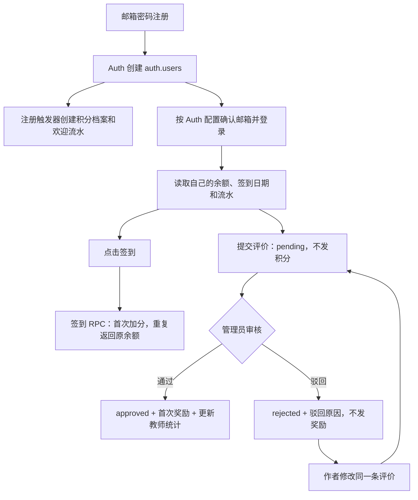

# 用户注册、签到与评价的后端流程

整理日期：2026-09-26。依据当前前端代码、P1 正式迁移文件及用户提供的线上注册/评分触发器定义。用户已反馈完成执行；本文描述对应代码行为，未重新连接线上数据库核查。本文不修改 SQL 或程序逻辑。

## 1. 整体关系

浏览器通过 Supabase SDK 调用 Supabase Auth 和数据库 API。注册与登录由 Auth 处理；表查询、评价提交和修改由 PostgreSQL 的授权及 RLS（逐行访问规则）控制；签到和审核通过 RPC 调用数据库函数。请求携带登录令牌，数据库用 `auth.uid()` 识别调用者。

签到和提交评价是登录后的两条独立路径，不要求先签到才能评价。

## 2. 注册：Auth 建账号，触发器建积分档案

1. 前端调用 `supabase.auth.signUp()`，提交邮箱、密码及昵称、学院、校区。
2. Supabase Auth 管理密码和身份，创建 `auth.users` 记录。昵称、学院、校区放在用户元数据中，不写入积分档案，也不用于授予管理员权限。
3. `auth.users` 的 `on_auth_user_created` 触发器调用线上现有的 `public.handle_new_user()`。
4. 该函数向 `user_profiles` 写入用户 ID 和初始余额 100；向 `point_transactions` 写入 `new_user_welcome`、变动 +100、变动后余额 100。
5. 如果 Supabase 开启邮箱确认，注册后先确认邮箱再取得正常登录会话；关闭确认时可直接获得会话。注册触发器在账号记录创建时执行，并不等待邮箱确认。

线上旧注册触发器在本次迁移中保留：赠分写死为 100，未读取 `point_rules`。因此仅修改 `new_user_welcome` 规则，不会改变这条正常注册路径的赠分。

旧触发器捕获所有异常并允许注册继续，因此账号可能创建成功但积分档案缺失。迁移新增的 `private.swjtu_ensure_profile()` 会在签到、消费或符合条件的审核发奖时，为确实存在的 Auth 用户补建缺失档案和欢迎流水；补建金额读取启用的注册规则。已有档案不会被重置。单纯登录或查询余额不会触发补建，缺失时查询会报错；前端的 `ensureUserProfile()` 当前是空实现。

## 3. 登录及加载个人数据

前端调用 `signInWithPassword()`。登录成功后，SDK 保存会话并自动刷新令牌，后续数据库请求带上该令牌。

| 读取对象 | 读取内容 | 访问边界 |
| --- | --- | --- |
| `user_profiles` | `points`、`last_checkin_date` | 只能读自己的记录 |
| `point_transactions` | 积分变动、原因、时间、变动后余额 | 只能读自己的流水 |
| `get_my_admin_status()` | 是否管理员、角色、昵称 | 服务端按调用者身份查询 |
| `reviews` | 已通过评价，以及本人待审/被驳回评价 | 管理员可读全部评价 |

余额以数据库为准，包括余额为 0 的情况。浏览器缓存不能覆盖成功读取的数据库余额，也不能作为发积分的依据。登录本身不重复赠送欢迎积分，也不自动签到。

## 4. 签到：一次事务完成查重、加分和流水

前端调用 `supabase.rpc('handle_daily_checkin')`，不传用户 ID 或奖励金额给数据库函数。

1. 函数通过 `auth.uid()` 获取真实用户；未登录则拒绝。
2. 检查并按需补建积分档案。
3. 用 `SELECT ... FOR UPDATE` 锁定用户积分行，再读取最后签到日期。
4. 以 `Asia/Shanghai` 的自然日判断今天是否已签到。
5. 已签到：返回当前余额及 `already_checked_in=true`，不写新流水。
6. 未签到：读取启用的 `point_rules.daily_checkin`，当前规则为 +5。
7. 更新 `user_profiles.points` 和 `last_checkin_date`，插入一条 `daily_checkin` 流水，返回新余额及 `already_checked_in=false`。

余额、日期和流水在同一个事务内提交。写流水失败时加分和日期更新也回滚；并发签到要等待同一积分行锁，后到的请求会看到已签到。

前端目前的签到成功文案和即时临时流水仍写死 +5，实际余额由函数返回；数据库正式流水按规则入账。如果未来调整签到规则，这两处显示也需要同步修改。

## 5. 提交评价：写入待审记录

前端读取教师、课程、学期等公开资料，用户选择教师/课程，填写学期、六项评分和文字评价。敏感词及非空短评长度检查目前在浏览器中执行，不能视为数据库内容审核。

`submitReview()` 先获取登录用户，再通过 `.from('reviews').insert(...)` 写入数据库，不调用发积分函数。

| 字段 | 写入内容 |
| --- | --- |
| `id` | 新评价 ID |
| `user_id` | 当前登录用户 ID |
| `teacher_id`、`course_id`、`year_term` | 教师、课程及学期 |
| 六个评分字段、`comment` | 用户评价内容 |
| `author_nickname` | 作者昵称 |
| `status` | `pending` |
| `is_historical_migrated`、`likes` | `false`、0 |

数据库 RLS 要求作者为当前用户、状态为待审、未伪造审核人/审核时间/驳回原因，并限制可写列。课程必须引用存在的课程记录。

提交成功后，作者和管理员可看到该待审记录，其他用户不能通过数据库读取它。提交不加积分，待审评价不纳入教师评分统计。评分触发器可能执行一次重算，但统计仍只使用已通过评价。

当前边界：`submitReview()` 在课程 ID 缺失且名称未匹配时，会尝试使用课程列表第一项；数据库外键仅保证课程存在，并没有校验该教师、课程和学期一定在开课表中组成有效关系。本次迁移也未新增“每人每门课只能评价一次”的唯一约束。

## 6. 管理员审核通过：公示与奖励一起提交

管理员客户端调用 `approve_review(p_review_id)`。每次调用都会在服务端重新鉴权：登录用户已验证的邮箱必须与启用的 `admin_users` 记录匹配，角色为 `super_admin`、`admin` 或 `moderator`。普通用户即使自行构造请求也不能完成审核。

函数按以下顺序执行：

1. 锁定目标评价；不存在则返回失败，已通过则返回成功且不重复奖励。
2. 对待审或被驳回评价设置 `approved`，清空驳回原因，记录审核人和时间。
3. 状态更新触发保留的 `trg_recalc_teacher_scores`，重算对应教师的已通过评价数量、六项均分和综合分。
4. 对非历史迁移评价，且作者在 `auth.users` 中仍存在的情况，检查/补建作者积分档案并锁定积分行。
5. 尝试在 `private.swjtu_review_rewards` 登记该评价 ID。该 ID 已登记则不再发奖。
6. 首次登记时读取启用的 `review_approved` 规则，当前为 +20，累加作者余额并写入关联该评价的积分流水。

评价状态、教师统计、奖励登记、余额和流水属于同一个事务。任一步报错，整次操作回滚。审核的是管理员，但积分发给评价作者。

通过后评价可公开读取，教师统计包含该评价。历史迁移评价或已无 Auth 账号的作者不参与新奖励。迁移时已为原有 approved 评价及关联正向流水登记防重标记，因此不追补历史奖励。

## 7. 驳回与重新提交

管理员调用 `reject_review(p_review_id, p_reason)`：服务端校验管理员资格和非空原因，写入 `rejected`、驳回原因、审核人及审核时间，并触发教师统计重算。

作者可修改自己的 `pending` 或 `rejected` 评价，通过更新同一条 `reviews` 记录将其改回 `pending` 并清空驳回原因，随后再次进入审核。作者不能修改已通过评价。

当前行为是：首次被驳回不发奖励；已经通过并发过奖励的评价，后来被驳回不会自动扣回奖励；同一评价再次通过也不会重复发奖。防重以评价 ID 为单位，不等同于禁止用户提交不同 ID 的多条评价。

保留的评分函数仅统计 approved 评价；若最后一条已通过评价被驳回，评价数会归零，但原均分因 `coalesce` 逻辑会保留，并不会自动清零。

## 8. 用户何时看到变化

签到成功后页面使用 RPC 返回的余额。登录、回到个人页、窗口重新激活时会重新读取余额和流水；代码也订阅评价变化后刷新数据，但跨设备即时通知依赖 Supabase Realtime 对 reviews 的实际配置，本次迁移没有新增 publication 配置。

积分读取请求失败时不会在后台补写余额。前端当前会把显示余额置为 0；该显示不代表数据库真实余额被清零。

按目前规则，无其他消费或奖励的新用户示例：

| 时点 | 余额 | 新增流水 |
| --- | ---: | --- |
| 注册建档成功 | 100 | `new_user_welcome` +100 |
| 当天首次签到 | 105 | `daily_checkin` +5 |
| 同日重复签到 | 105 | 无 |
| 提交评价待审核 | 105 | 无 |
| 评价首次审核通过 | 125 | `review_approved` +20 |
| 同一评价重复审核通过 | 125 | 无 |

## 9. 实现位置

- `src/services/supabaseService.ts`：Auth、数据库表读写、RPC 调用。
- `src/App.tsx`：签到、提交、审核和数据刷新入口。
- `src/components/AuthModal.tsx`、`src/components/ReviewModal.tsx`：注册和评价表单。
- `supabase/security.sql`：迁移后的 RLS、RPC 和奖励防重逻辑。
- `supabase/production-compat.sql`：兼容字段、默认值和索引。
- 线上 `handle_new_user()`、`recalc_teacher_scores()`：依据用户提供的结构报告，正式迁移保留其原有定义。`supabase/fresh-hooks.sql` 是全新数据库用的触发器，不应当作线上注册逻辑的依据。
